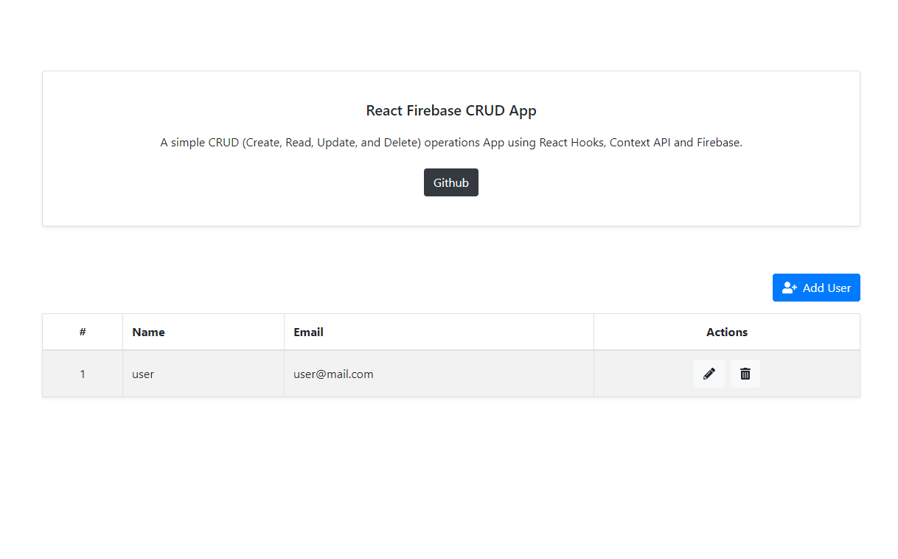

# React Firestore CRUD App

A simple CRUD (`Create`, `Read`, `Update`, `Delete`) React App using Hooks, Context API, Cloud Firestroe and Bootstrap for the UI.



### Instructions

- Download or clone the repo:

```
https://github.com/awran5/react-firestore-crud-app.git
```

- Create a new [firebase](https://console.firebase.google.com/) project or use your existing one and enable **Cloud Firestore** database.
- Create a new `.env.local` file inside the main app folder and copy/paste your firebase project `configuration`.

```
  REACT_APP_FIREBASE_API_KEY = xxxxxxxxxxxxxxxxxxxxxx
  REACT_APP_FIREBASE_AUTH_DOMAIN = xxxxxxxxxxxxxxxxxxxxxx
  REACT_APP_FIREBASE_DATABASE_URL = xxxxxxxxxxxxxxxxxxxxxx
  REACT_APP_FIREBASE_PROJECT_ID = xxxxxxxxxxxxxxxxxxxxxx
  REACT_APP_FIREBASE_STORAGE_BUCKET = xxxxxxxxxxxxxxxxxxxxxx
  REACT_APP_FIREBASE_MESSAGING_SENDER_ID = xxxxxxxxxxxxxxxxxxxxxx
  REACT_APP_FIREBASE_APP_ID = xxxxxxxxxxxxxxxxxxxxxx
```

### Demo: [https://react-firestore-crud-app.vercel.app/](https://react-firestore-crud-app.vercel.app/)
